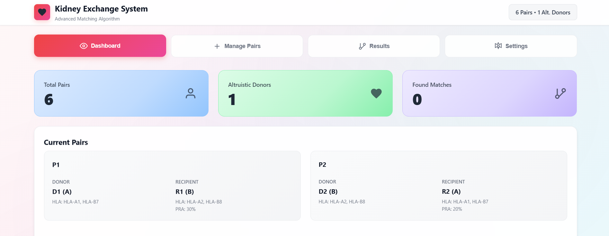
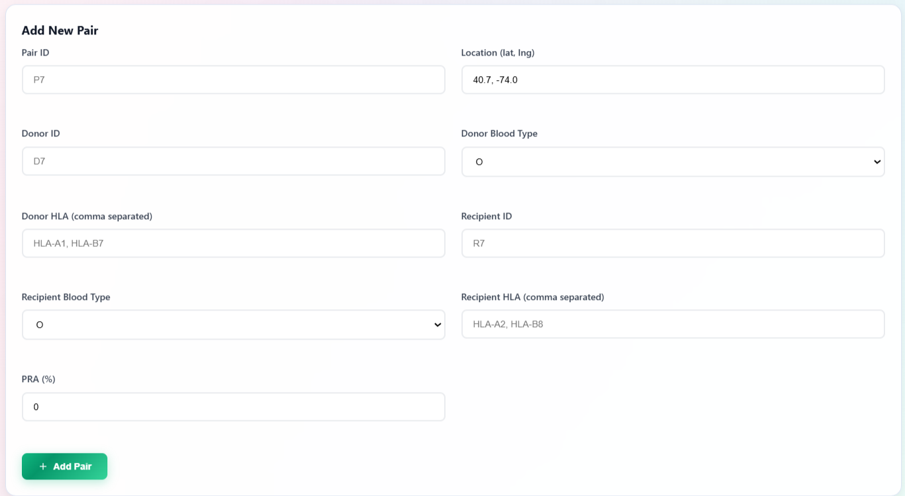
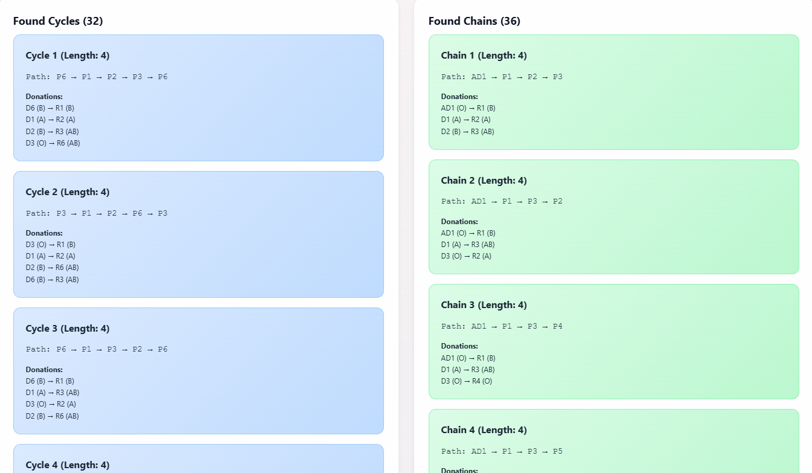
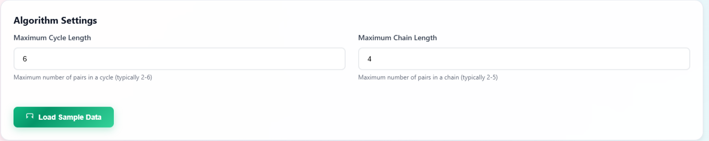

# Kidney Exchange System

An **interactive browser-based simulator** for kidney exchange programs.  
Built entirely in **HTML, CSS, and JavaScript**, this tool lets you add donor–recipient pairs, configure compatibility rules, and visualize matching cycles and chains — all in a clean, responsive UI.

---

## 🚀 Features

### 🧍 Pair & Donor Management

- Add **donor–recipient pairs** with:
  - Blood type
  - HLA markers
  - PRA %
  - Geographic location
- Add **altruistic donors** to start chain matches.

---

### 🧮 Matching Algorithm

- **Weighted compatibility scoring**:
  - **HLA marker match** → 50%
  - **PRA level penalty** → 30%
  - **Geographic distance** → 20%
- Supports:
  - **Cycles** → closed loops of donations
  - **Chains** → open sequences starting with an altruistic donor

---

### ⚙ Customization

- Change **maximum cycle** and **chain** length.
- Filter matches by:
  - Pair ID
  - Target length
- Load **sample data** for quick testing.

---

## 🖥 How to Run

### ▶ Locally

1. Clone or download this repository.
2. Open `index.html` in any modern browser.
